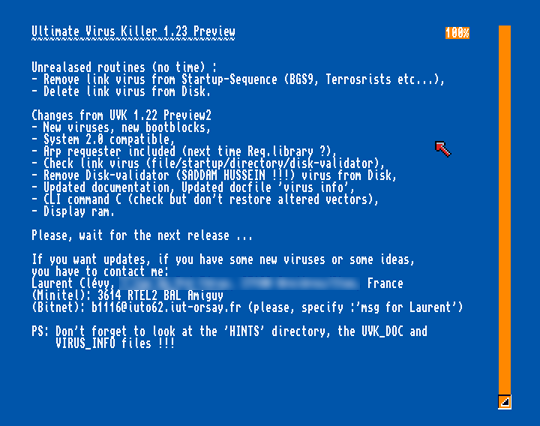
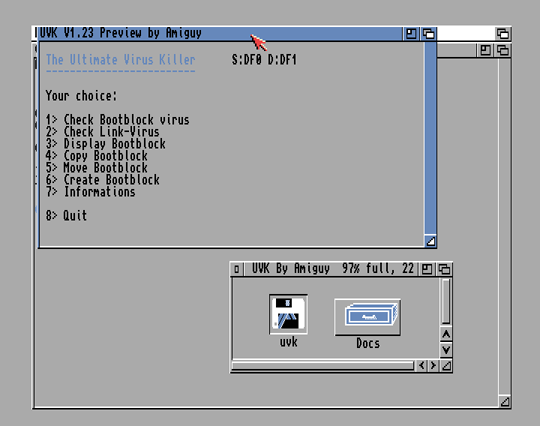
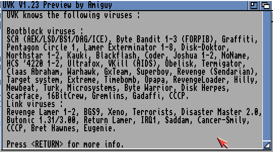
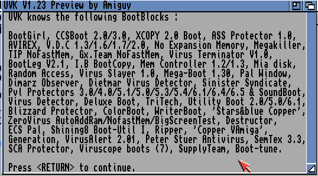
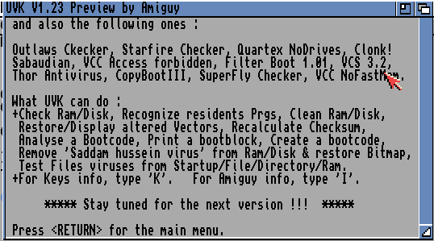
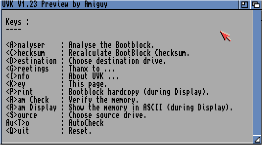
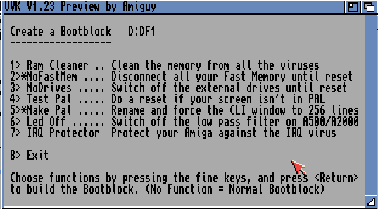
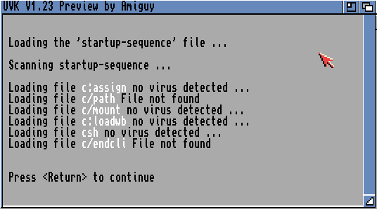

# the Amiga Ultimate Virus Killer (UVK) # 

This Virus Killer (antivirus) has been written for the Amiga between between 02/1989 (1.0) and 12/1991 (1.23 preview). 

This is how I learnt the 68000 assembler.

The latest version has 3774 lines of assembly (code + data). 

.adf files (Amiga Dump File) can be explored using unadf : https://github.com/adflib/ADFlib/releases

* [UVK source code](uvk1.22.txt)
* [UVK documentation (french) ](docs/uvk_doc.txt)
* [Information about the 50+17 viruses I has disassembled](docs/virus_info.txt)

* disk archives (ADF):
  * [Viruses and bootblocks database, and source codes](adf/text_boot_virus.adf)
  * [UVK distribution disk](adf/uvk_exe.adf)
  * [Source code floppy disk](adf/uvk_codes.adf)

<table border="0" cellpadding="2" cellspacing="2">
  <tbody>
    <tr>
      <td></td>
      <td></td>
    </tr>
    <tr>
      <td></td>
      <td></td>
    </tr>
    <tr>
      <td></td>
      <td></td>
    </tr>
    <tr>
      <td></td>
      <td></td>
    </tr>
  </tbody>
</table>

